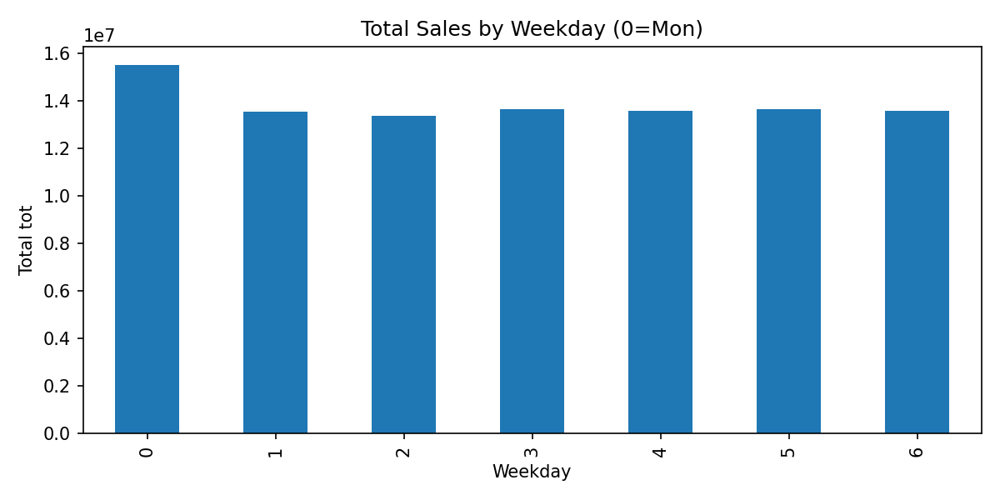
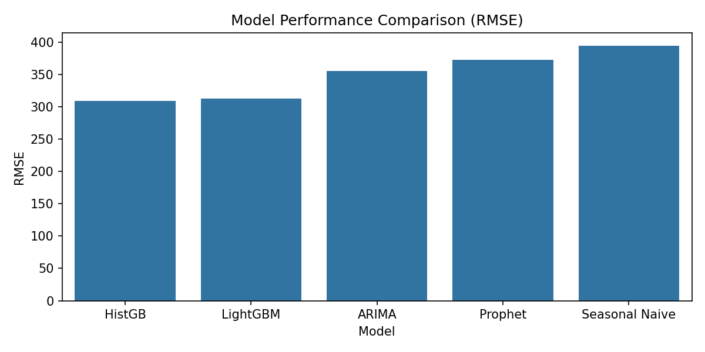
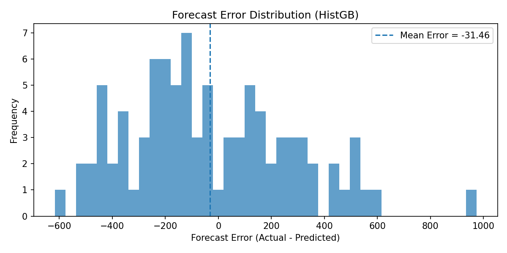
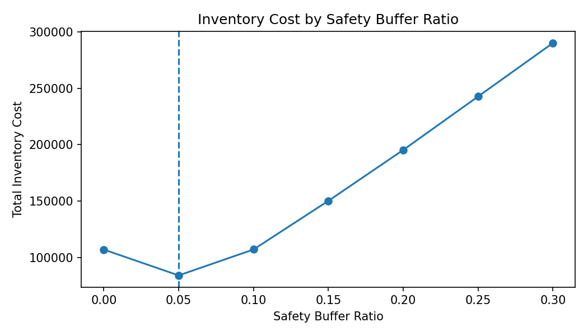

# Retail Demand Forecasting & Inventory Risk Simulation

A data analytics project that benchmarks multiple forecasting models on large-scale retail sales data and evaluates their operational impact on inventory management.

---

# Project Overview

Accurate demand forecasting is critical for retail operations. Forecast errors often lead to:

- **Stockouts** → lost sales opportunities  
- **Overstock** → increased inventory holding costs  
- **Inefficient inventory allocation**

This project evaluates whether **feature-based machine learning models** can improve demand forecasting accuracy compared to traditional baseline approaches.

The analysis also includes an **inventory risk simulation** to estimate how improved forecasts can reduce operational costs.

---

# Key Results

| Metric | Result |
|------|------|
| Dataset Size | 10M+ retail transactions |
| Forecast Horizon | 90 days |
| Best Model | HistGradientBoosting |
| RMSE Improvement | 21.8% vs baseline |
| Forecast Accuracy | 4.91% WMAPE |

### Business Impact

Improved forecasting reduced prediction error by:

- **3,329 units during the evaluation period**
- **~1,110 units per month**

Inventory simulation indicates that:

> **A 5% safety buffer minimizes total inventory cost**

---

# Dataset

The dataset consists of large-scale retail sales transactions.

| Column | Description |
|------|------|
| date | transaction date |
| cate | product category |
| name | product name |
| mart | sales channel |
| tot | quantity sold |

Dataset characteristics:

- 10M+ rows
- Multiple CSV files
- ~160MB raw data

---

# Exploratory Data Analysis

## Weekly Demand Pattern

Retail demand shows clear weekly seasonality.



**Insight**

- Sales vary significantly by weekday
- Certain weekdays consistently exhibit higher demand
- Weekly patterns provide valuable features for forecasting models

---

# Forecasting Models

Multiple models were evaluated:

- Seasonal Baseline
- Random Forest
- Gradient Boosting
- HistGradientBoosting

## Model Performance Comparison



**Result**

HistGradientBoosting achieved the lowest RMSE and significantly outperformed the baseline model.


# Forecast Model Comparison

The following visualization compares predictions from multiple models
against actual demand for a representative product category.


**Insight**

- Machine learning models capture overall demand patterns better than the baseline.
- HistGradientBoosting provides the most stable predictions across time.
- Large forecast errors mainly occur during sudden demand spikes.
---


# Forecast Example

The following visualization compares model forecasts with actual demand.


**Insight**

- The model captures overall demand trends and seasonal patterns
- Most prediction errors occur during sudden demand spikes

---

# Forecast Error Distribution



The histogram shows the distribution of forecast errors (Actual − Predicted).

Most errors are centered near zero, indicating minimal systematic bias.  
The mean error (-31.46) suggests a slight tendency toward over-forecasting.

A long right tail indicates occasional underestimation during demand spikes, which is common in retail forecasting.

---

# Inventory Risk Simulation

To evaluate operational impact, an inventory policy simulation was conducted.



### Inventory Policy

```
Stock = Forecast + Safety Buffer
```

### Cost Assumptions

| Cost Type | Value |
|------|------|
| Holding Cost | 2 |
| Stockout Cost | 8 |

**Result**

A **5% safety buffer** minimizes total cost by balancing:

- stockout risk
- inventory holding cost

---

# Forecasting Pipeline

The project follows a structured forecasting workflow:

1. Data ingestion and preprocessing
2. Feature engineering
3. Model benchmarking
4. Walk-forward time series validation
5. Forecast error analysis
6. Inventory risk simulation

---

# Tech Stack

| Category | Tools |
|------|------|
| Programming | Python |
| Data Processing | Pandas |
| Modeling | Scikit-learn |
| Visualization | Matplotlib |
| Storage | Parquet |
| Validation | Walk-forward time-series validation |

---

# Repository Structure

```
project
│
├── data
│
├── visuals
│   ├── eda_sales_by_weekday.png
│   ├── model_rmse_comparison.png
│   ├── forecast_model_comparison_top_category.png
│   ├── error_distribution_HistGB.png
│   └── inventory_cost_by_buffer_ratio.png
│
├── notebooks
│   └── Demand_Forecasting_Model_Benchmark.ipynb
│
└── README.md
```

---

# Author

Data Analytics Portfolio Project  

Focus areas:

- Demand Forecasting
- Retail Analytics
- Inventory Optimization
- Machine Learning for Business Operations
