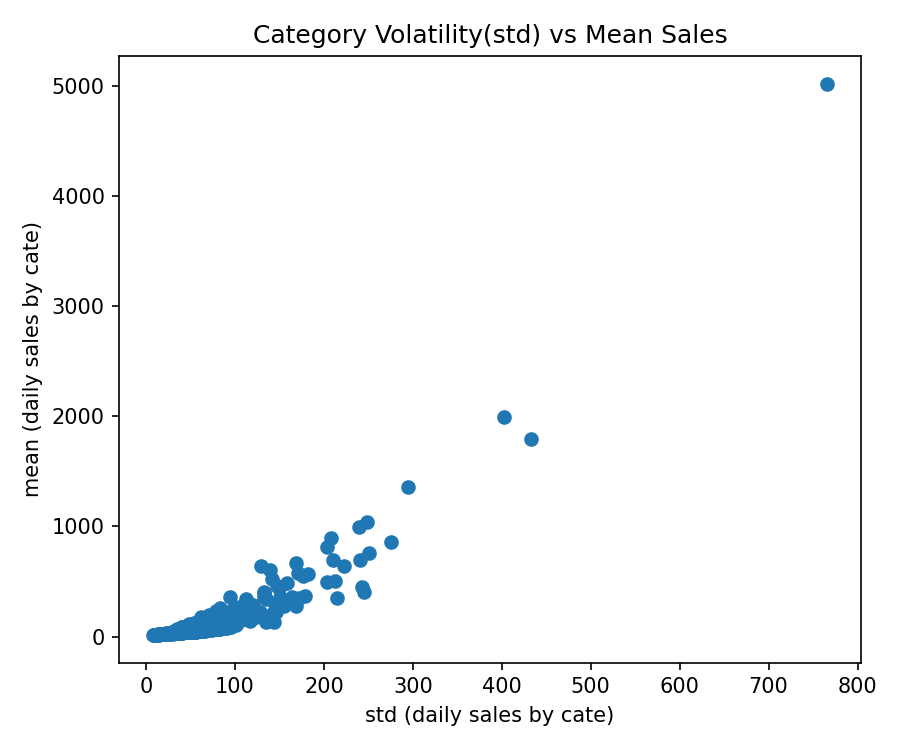
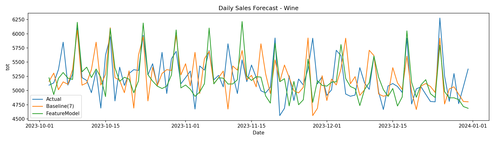
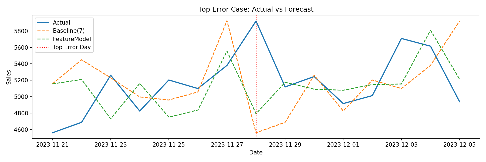

#  Zero-Sales 왜곡을 고려한 판매 예측 및 재고 리스크 최소화 전략

> **"모델 성능 개선은 수단이며, 목표는 데이터 기반의 재고 운영 의사결정 고도화입니다."**

본 프로젝트는 이커머스 환경에서 빈번히 발생하는 **Zero-sales(판매량 0) 데이터의 특성**을 반영하여, 기존 지표의 한계를 극복하고 재고 부족 및 과잉으로 인한 비즈니스 손실을 최소화하기 위한 분석 파이프라인과 예측 모델을 구축한 사례입니다.

---

##  비즈니스 성과 (Business Impact)
* **예측 오차 정량적 감소:** 테스트 90일 구간 기준, Baseline 대비 총 절대 오차(Total Abs Error) **3,020 units 절감**.
* **일일 운영 효율 최적화:** 하루 평균 **34 단위의 재고 예측 오차를 개선**하여 물류 및 보관 비용 최적화 근거 마련.
* **지표 신뢰도 확보:** Zero-sales 비율(5.5%)에서 왜곡되는 MAPE 대신 **WMAPE를 도입**하여 현업 활용 가능성 증대.

---

##  문제 정의 (Problem Definition)
* **배경:** 이커머스 수요 예측 오차는 품절로 인한 '매출 손실'과 재고 과잉으로 인한 '보관/폐기 비용'으로 직결됨.
* **현상:** 전체 데이터 중 **Zero-sales 비중이 5.5%**에 달해, 일반적인 MAPE 사용 시 분모가 0이 되거나 수치가 무한대로 발산하는 문제 발생.
* **목표:** WMAPE 기반의 `HistGradientBoostingRegressor` 모델을 통해 예측 정확도를 높이고 재고 리스크를 관리함.

---

##  분석 프로세스 (Methodology)

### 1. Data Engineering & Preprocessing
* **규모:** 약 1,000만 건의 대용량 거래 데이터 처리 (2020~2023).
* **Feature Engineering:** - 시계열 특성 반영: Lag 변수(1, 7, 14, 28일), Rolling Mean/Std 추출.
  - 외부 요인: 요일, 시간대 등 캘린더 변수 생성.

### 2. 통계적 가설 검증 및 EDA
#### [분석 1] 요일 및 시간대별 판매 패턴 (ANOVA)

* ANOVA 검정을 통해 주말과 평일 간의 판매량 차이가 통계적으로 유의미함을 확인($p < 0.05$). 주중 물류 센터 인력 배치 최적화의 근거로 활용 가능합니다.

#### [분석 2] 상품군별 예측 난이도 세그먼트화

* 카테고리별 변동성(Std)과 평균 판매량(Mean)의 상관관계를 분석하여, 예측이 까다로운 '고변동 상품군'을 식별하고 재고 안전 계수 차등 적용의 기반을 마련했습니다.

---

##  모델 성능 평가 (Model Evaluation)

Baseline(Seasonal Naive) 대비 제안 모델이 모든 지표에서 우수한 성능을 보였습니다. 특히 **WMAPE 기준 약 0.64%p 개선**을 달성했습니다.

| Model | MAE | RMSE | **WMAPE (%)** |
| :--- | :--- | :--- | :--- |
| Baseline (Seasonal Naive) | 294.0 | 394.69 | 5.615% |
| **HGBR (Lag+Rolling+Calendar)** | **260.45** | **314.18** | **4.974%** |

#### [예측 결과 시각화: Wine 카테고리]

* 실제 판매량(Actual)의 변동 추이를 모델이 안정적으로 학습하여 추종하고 있음을 확인했습니다.

---

##  인사이트 및 에러 세그먼트 분석
#### [에러 집중 구간 분석]

1. **특이치 분석:** 오차가 가장 컸던 'Top 10 Days'를 분석한 결과, 일반적인 패턴을 벗어나는 특정 프로모션 및 이벤트 기간에 오차가 집중됨을 확인했습니다.
2. **향후 과제:** - '이벤트 플래그(Promotion Flag)' 데이터를 추가 피처로 반영하여 대형 행사 기간의 예측 정교화 필요.
   - 분석된 예측 오차 범위를 바탕으로 상품별 **안전 재고(Safety Stock)** 산출 공식 고도화.

---
